<div style="margin-bottom: 20px; display:flex; justify-content: center; align-items: center ">

</div>

# Coral Bleaching

Partial bleaching: beyond some temperature thresholds (too high, too cold), smaller corals will bleach and die more quickly (`deathSpeed`).

`kelpAmount` is the vitality of the coral. We derive the growth from this amount.

Staying too long in the dying state will definitely kill the coral. As long as the coral is not dead, it can revive and go out of the dying state.

## Installation

## Running the app

Create a `.env.development` file with the following content:

```bash
VITE_PORT=3005
VITE_API_HOST=http://localhost:3000
VITE_ENABLE_MOCK_API=true
VITE_GRAASP_APP_KEY=45678-677889
VITE_VERSION=latest
```

## Running the tests

Create a `.env.test` file with the following content:

```bash
VITE_PORT=3333
VITE_API_HOST=http://localhost:3636
VITE_ENABLE_MOCK_API=true
VITE_GRAASP_APP_KEY=45678-677889
VITE_VERSION=latest

# dont open browser
BROWSER=none
```

---

## Coral bleaching

```mermaid
stateDiagram-v2
[*] --> Growing
Growing --> Growing: kelpCount, 23-28°c = +1, otherwise -1

    Growing --> Dead: kelpCount == 0
    Dead --> Dead
```


